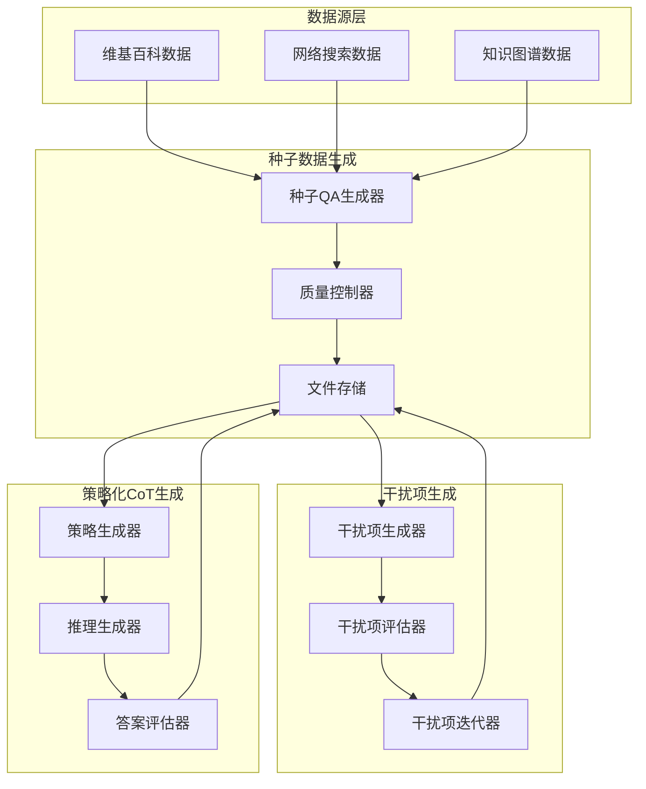
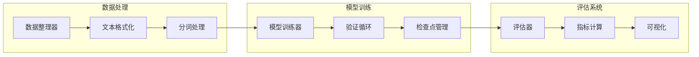

# PrismRAG 系统架构设计文档

## 系统概述

PrismRAG 是一个基于 Meta AI 研究论文的高效微调框架，通过干扰项抵抗力和策略化思维链来提升检索增强生成(RAG)的事实性。

## 核心特性

- 🎯 **事实性提升**: 在12个RAG QA基准测试中平均提升5.4%的事实性得分
- 🛡️ **抗干扰能力**: 有效处理半相关和混淆性检索内容
- 🧠 **智能推理**: 动态生成推理策略，适应不同问题类型
- 📊 **可扩展性**: 支持大规模合成数据生成和自动质量评估

## 系统架构

### 1. 数据生成管道

### 2. 训练框架

## 模块详细设计

### 数据生成模块

#### 种子数据生成器 (SeedDataGenerator)
- **功能**: 从原始文档生成问答对
- **输入**: 维基百科页面、网络搜索结果、知识图谱数据
- **输出**: 高质量的问答段落三元组
- **算法**: 逆向问题解决方法，给定文档块生成相关问题

#### 干扰项生成器 (DistractorGenerator)
- **功能**: 生成混淆性干扰内容
- **策略**: 修改命名实体、位置和时间信息
- **质量评估**: 相关性、干扰性、格式相似性评分
- **迭代优化**: 基于反馈的多次生成尝试

#### 策略化CoT生成器 (StrategicCoTGenerator)
- **功能**: 生成动态推理策略
- **流程**: 策略生成 → 推理执行 → 质量评估 → 迭代优化
- **特点**: 减少对人工设计指令的依赖

### 训练模块

#### 数据整理器 (DataCollator)
- **功能**: 处理不同格式的训练数据
- **支持**: 干扰项数据、CoT数据、混合数据
- **特性**: 动态批处理、序列填充、注意力掩码

#### 模型训练器 (ModelTrainer)
- **架构**: 基于Hugging Face Transformers
- **优化**: 梯度累积、学习率调度、权重衰减
- **监控**: 训练指标、验证损失、生成质量

### 评估模块

#### 基准测试系统
- **数据集**: 12个公开RAG QA基准
- **指标**: 事实性得分、准确率、幻觉率、缺失率
- **方法**: LLM作为评判员、事实检查工具

#### 质量评估器
- **功能**: 自动化数据质量评估
- **维度**: 相关性、正确性、连贯性、实用性
- **集成**: 多模型评估、人工验证接口

## 数据流程

1. **原始数据获取**
   - 维基百科数据转储处理
   - 网络搜索API集成
   - 知识图谱数据解析

2. **种子数据生成**
   - 文档分块处理
   - QA对逆向生成
   - 初步质量筛选

3. **干扰项生成**
   - 关键信息识别
   - 系统性修改
   - 质量迭代优化

4. **策略化CoT生成**
   - 高层策略制定
   - 详细推理生成
   - 多轮评估优化

5. **训练数据组合**
   - 数据混合比例控制
   - 质量阈值过滤
   - 最终数据集构建

## 技术栈

### 核心框架
- **Python 3.8+**
- **PyTorch 2.0+**
- **Transformers 4.30+**
- **Hugging Face Ecosystem**

### 数据处理
- **Datasets**: 高效数据加载和处理
- **Pandas**: 数据分析和转换
- **NLTK/Spacy**: 文本处理和NLP工具

### 评估工具
- **Weights & Biases**: 实验跟踪和可视化
- **MLflow**: 模型管理和部署
- **Prometheus**: 系统监控

## 性能考虑

### 计算优化
- **梯度检查点**: 减少内存使用
- **混合精度训练**: FP16/BF16支持
- **分布式训练**: 多GPU/多节点支持

### 内存管理
- **流式数据处理**: 支持大规模数据集
- **动态批处理**: 根据序列长度优化
- **缓存机制**: 重复计算避免

## 扩展性设计

### 模块化架构
- 插件式数据源支持
- 可配置生成策略
- 自定义评估指标

### API设计
- RESTful 数据接口
- 流式处理支持
- 批量作业管理

## 部署方案

### 开发环境
- Docker容器化
- 开发配置模板
- 本地测试套件

### 生产环境
- Kubernetes编排
- 自动扩缩容
- 监控告警系统

## 质量保证

### 测试策略
- 单元测试: 核心算法验证
- 集成测试: 模块间协作
- 端到端测试: 完整流程验证

### 代码质量
- 类型注解覆盖
- 代码规范检查
- 自动化代码审查

---

*此文档为PrismRAG系统的技术架构设计，后续将基于此设计进行具体实现。*