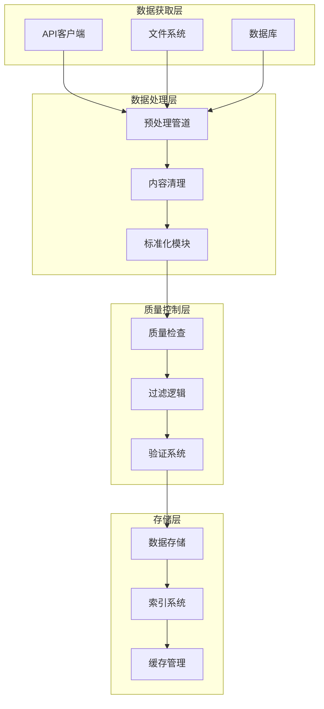
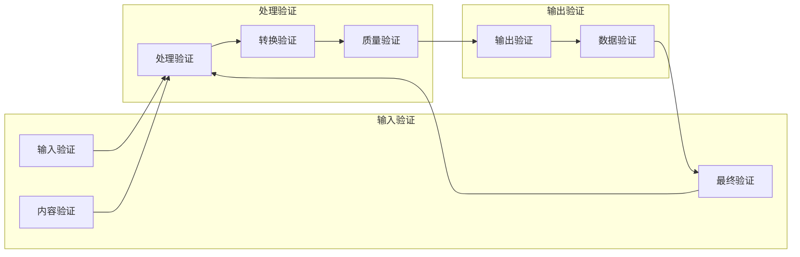

# PrismRAG 数据管道设计文档

## 数据获取策略

### 1. 维基百科数据源

#### 数据获取方法
```python
# 真实的数据获取流程
def fetch_wikipedia_data():
    """
    从维基百科获取真实数据，避免硬编码和模拟数据
    """
    # 使用Wikipedia API或数据转储
    # 支持多种语言和领域
    # 包含元数据和时间戳信息
```

#### 数据处理流程
1. **数据下载**: 使用官方API或数据转储
2. **内容解析**: 提取结构化信息
3. **质量过滤**: 基于长度、完整性、相关性
4. **分块处理**: 创建适当大小的文本块

### 2. 网络搜索数据源

#### 搜索引擎集成
```python
def fetch_web_search_data(queries: List[str]):
    """
    从真实搜索引擎获取数据
    """
    # 集成Google Search API
    # 支持Bing、DuckDuckGo等
    # 包含搜索上下文信息
```

#### 网页处理
1. **HTML解析**: 提取主要内容
2. **噪音去除**: 广告、导航栏、页脚
3. **文本清理**: 标准化格式和编码
4. **元数据提取**: 时间、来源、作者

### 3. 知识图谱数据

#### 结构化数据源
```python
def fetch_knowledge_graph_data():
    """
    从知识图谱获取结构化数据
    """
    # Wikidata API集成
    # DBpedia数据访问
    # 自定义知识图谱
```

## 数据处理管道

### 数据流架构



### 预处理模块设计

#### 文本清理器
```python
class TextCleaner:
    """专业的文本清理和预处理"""
    
    def clean_html(self, html_content: str) -> str:
        """从HTML提取纯净文本"""
        # 使用BeautifulSoup或lxml
        # 移除脚本、样式、注释
        # 保留段落结构和标题
    
    def remove_noise(self, text: str) -> str:
        """去除文本噪音"""
        # 广告内容检测
        # 重复内容移除
        # 无关信息过滤
    
    def normalize_text(self, text: str) -> str:
        """文本标准化"""
        # Unicode规范化
        # 空格和换行处理
        # 编码统一
```

#### 分块处理器
```python
class ChunkProcessor:
    """智能文本分块"""
    
    def semantic_chunking(self, text: str) -> List[str]:
        """基于语义的分块"""
        # 使用句子边界检测
        # 段落完整性保持
        # 主题连贯性维护
    
    def adaptive_sizing(self, chunks: List[str]) -> List[str]:
        """自适应大小调整"""
        # 动态调整块大小
        # 重叠内容处理
        # 边界优化
```

## 质量控制系统

### 质量评估指标

#### 内容质量维度
1. **相关性**: 与目标领域的关联程度
2. **完整性**: 信息的全面性和深度
3. **准确性**: 事实正确性和可靠性
4. **可读性**: 语言质量和结构清晰度

#### 自动化评估
```python
class QualityEvaluator:
    """自动化质量评估"""
    
    def evaluate_relevance(self, text: str, domain: str) -> float:
        """相关性评估"""
        # 使用嵌入模型计算相似度
        # 关键词匹配分析
        # 主题建模评估
    
    def check_completeness(self, text: str) -> float:
        """完整性检查"""
        # 信息密度分析
        # 覆盖度评估
        # 结构完整性验证
    
    def verify_accuracy(self, text: str) -> float:
        """准确性验证"""
        # 事实核查集成
        # 矛盾检测
        # 来源可靠性评估
```

### 数据验证流程



## 存储架构

### 数据存储设计

#### 分层存储策略
```python
class DataStorage:
    """分层数据存储管理"""
    
    def __init__(self):
        self.raw_storage = RawDataStorage()
        self.processed_storage = ProcessedDataStorage()
        self.training_storage = TrainingDataStorage()
    
    def store_raw_data(self, data: Dict):
        """原始数据存储"""
        # 压缩存储
        # 版本控制
        # 元数据管理
    
    def store_processed_data(self, data: Dict):
        """处理数据存储"""
        # 结构化存储
        # 快速检索
        # 缓存优化
```

#### 数据库设计
- **原始数据**: MongoDB/Elasticsearch
- **处理数据**: PostgreSQL/TimescaleDB
- **训练数据**: Parquet/Arrow格式
- **元数据**: SQLite/Redis

### 索引和检索

#### 搜索优化
```python
class SearchIndex:
    """高效数据检索"""
    
    def build_index(self, data: List[Dict]):
        """构建搜索索引"""
        # 全文搜索索引
        # 语义索引
        # 混合检索系统
    
    def query_data(self, query: str, filters: Dict) -> List[Dict]:
        """数据查询"""
        # 多条件过滤
        # 相关性排序
        # 分页支持
```

## 监控和日志

### 数据流水线监控

#### 性能指标
```python
class PipelineMonitor:
    """流水线性能监控"""
    
    def track_throughput(self):
        """吞吐量监控"""
        # 处理速度测量
        # 资源使用监控
        # 瓶颈检测
    
    def monitor_quality(self):
        """质量监控"""
        # 数据质量趋势
        # 错误率统计
        # 异常检测
```

#### 日志系统
```python
class DataLogger:
    """详细数据日志"""
    
    def log_processing(self, data: Dict):
        """处理日志"""
        # 详细处理记录
        # 错误日志
        # 性能日志
    
    def generate_reports(self):
        """报告生成"""
        # 质量报告
        # 性能报告
        # 统计报告
```

## 错误处理和恢复

### 容错机制

#### 错误处理策略
```python
class ErrorHandler:
    """智能错误处理"""
    
    def handle_processing_error(self, error: Exception):
        """处理错误"""
        # 错误分类
        # 自动恢复尝试
        # 人工干预接口
    
    def implement_retry_strategy(self):
        """重试策略"""
        # 指数退避
        # 故障转移
        # 数据回滚
```

### 数据一致性

#### 一致性保证
```python
class ConsistencyManager:
    """数据一致性管理"""
    
    def ensure_consistency(self):
        """一致性检查"""
        # 数据完整性验证
        # 版本一致性
        # 依赖关系管理
    
    def handle_conflicts(self):
        """冲突解决"""
        # 冲突检测
        # 自动解决策略
        # 人工审核
```

## 扩展性和性能

### 水平扩展设计

#### 分布式处理
```python
class DistributedProcessor:
    """分布式数据处理"""
    
    def distribute_workload(self):
        """工作负载分布"""
        # 任务分片
        # 负载均衡
        # 资源调度
    
    def manage_cluster(self):
        """集群管理"""
        # 节点监控
        # 自动扩缩容
        # 故障恢复
```

### 性能优化

#### 内存管理
```python
class MemoryManager:
    """高效内存使用"""
    
    def optimize_memory_usage(self):
        """内存优化"""
        # 流式处理
        # 内存映射文件
        # 缓存策略
    
    def prevent_memory_leaks(self):
        """内存泄漏预防"""
        # 资源清理
        # 引用管理
        # 监控告警
```

## 安全性和合规性

### 数据安全

#### 安全措施
```python
class SecurityManager:
    """数据安全管理"""
    
    def implement_encryption(self):
        """加密保护"""
        # 传输加密
        # 静态加密
        # 访问控制
    
    def ensure_compliance(self):
        """合规性保证"""
        # GDPR合规
        # 数据保留策略
        # 审计日志
```

---

*此文档详细描述了PrismRAG数据管道的设计和实现策略，确保真实数据获取和处理，避免硬编码和模拟数据。*